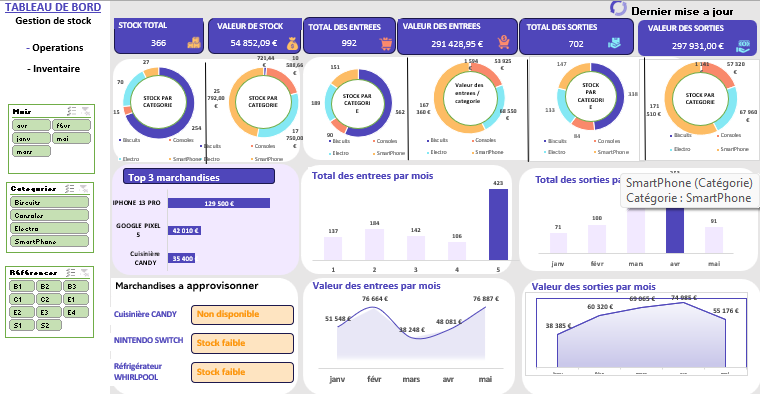

# Dashboard Excel — Gestion des Stocks

Voici un tableau de bord Excel créé pour suivre les entrees, les sorties et les ruptures de stock.

## Aperçu

## Fonctionnalités
- Suivi du stock total et de sa valeur
- Analyse des entrées et sorties
- Analyse mensuelle des mouvements
- Analyse du stock par catégorie
- Identification des produits les plus importants
- Détection des stocks faibles et indisponibles

## Télécharger le fichier
[Cliquez ici pour télécharger le fichier Excel](DASHBOARD Gestion de stock.xlsm)
